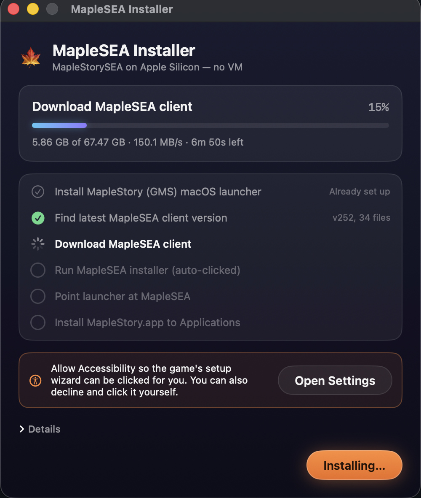

# 🍁 MapleSEA on Mac

Run **MapleStorySEA** natively on Apple Silicon Macs — no VM, no Boot Camp — by
repointing the official GMS macOS client's Crossover/Wine wrapper at the SEA client.

<p align="center"></p>

A one-click SwiftUI installer app that automates the whole thing:

1. **Install the GMS launcher** — downloads Nexon's `MapleStory.pkg` and runs it once
   to create the Wine bottle (skipped if already installed).
2. **Find the latest client** — scrapes the [official MapleSEA download page](https://www.maplesea.com/download/gameclient)
   for the newest full-client version, so it never installs a stale build.
   Falls back to probing PlayPark's CDN directly if the page layout changes.
3. **Download the full client** — `setup.exe` + all `setup-N.bin` parts, resumable,
   straight from PlayPark's CDN.
4. **Run the installer under Wine** — silently (`/VERYSILENT`; the client ships an
   Inno Setup installer), no wizard and no clicks. If a region's installer ignores
   the flags, click through the wizard that appears — completion is detected either way.
5. **Repoint the launcher** — writes `.ms-launch-args` into the bottle's `drive_c`
   and locks it with `chflags uchg` so the launcher can't delete it.
6. **Install `MapleStory.app`** — copies the wrapper app to `/Applications`.
7. **Clean up** — deletes the downloaded installer files (~67 GB) once the game
   is installed.

Docs site: **https://maplesea.hoshinoht.dev**

## Build & run

Requires macOS 14+ and the Xcode Command Line Tools (`xcode-select --install`).
No full Xcode needed.

```bash
git clone https://github.com/hoshinoht/MaplestorySEA-Macos.git
cd MaplestorySEA-Macos
./build.sh
open "build/MapleSEA Installer.app"
```

The app is **ad-hoc signed**. On first launch macOS blocks it once — approve it under
**System Settings → Privacy & Security → "Open Anyway"**, or clear quarantine yourself:

```bash
xattr -d com.apple.quarantine "build/MapleSEA Installer.app"
```

## Permissions

| Permission | Why | Optional? |
|---|---|---|
| Administrator password | Installing Nexon's launcher pkg | Skipped if the launcher is already installed |

That's the only one — the MapleSEA installer itself runs silently under Wine.

## How the launcher redirect works

The Crossover wrapper looks for a shell fragment at `drive_c/.ms-launch-args` and, if
present, launches that target instead of opening the Nexon NA flow:

```sh
MS_LAUNCH_DIR="C:\Program Files (x86)\Wizet\MapleStorySEA"
MS_LAUNCH_APP="C:\Program Files (x86)\Wizet\MapleStorySEA\MapleStory.exe"
MS_LAUNCH_ARGS=""
```

The launcher deletes this file on every run, so the installer sets the BSD
user-immutable flag (`chflags uchg`) on it.

## Other regions

Region specifics (download page, CDN base, install path) live in
[`RegionConfig.swift`](Sources/MapleSEAInstaller/RegionConfig.swift). Adding another
region is a new static config, not a code change. PRs welcome.

## GitHub Pages (docs/)

The `docs/` folder is a static landing page served via GitHub Pages at
`maplesea.hoshinoht.dev`. To activate: repo **Settings → Pages → Deploy from branch →
`master` / `docs`**, and add a DNS record `CNAME maplesea → hoshinoht.github.io`.

## Credits & legal

- Based on the original [r/MapleSEA guide](https://www.reddit.com/r/MapleSEA/comments/1v3gn9r/guide_running_maplesea_on_apple_silicon_mac_nonvm/).
- This repository contains **only automation code**. All game files are downloaded from
  official Nexon / PlayPark servers at install time; nothing is redistributed here.
- MapleStory is a trademark of Nexon. MapleStorySEA is operated by Playpark. This
  project is affiliated with neither.

MIT licensed.
